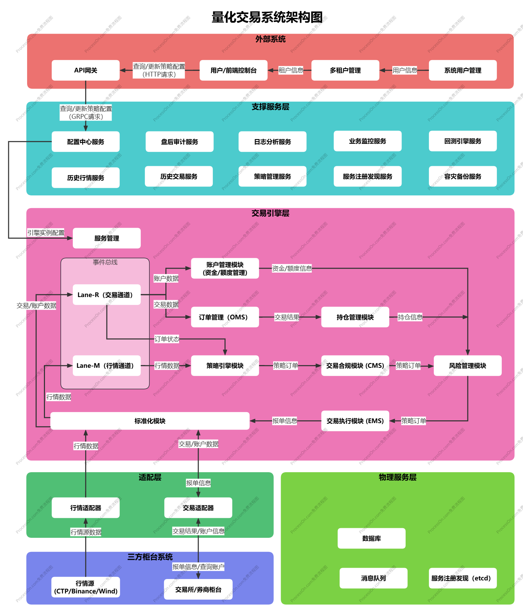

# 量化交易系统架构设计

## 一、系统定位与目标

### 1.1 系统定位

本系统定位为**面向机构客户的多租户量化交易平台**。核心交易引擎采用单进程、事件驱动架构，支撑策略研发、回测、仿真和实盘交易。

当前阶段重点是：低延迟、交易状态正确、故障后可以恢复、操作可以审计。主备自动切换和跨机房容灾属于后续能力，完成单活控制、订单恢复和对账设计后再承诺。

### 1.2 核心目标

- **低延迟**：**本地决策链路**（A 段，§2.1.1：策略 worker 上从 `On*` 至 `OrderIntent` 入队）P99 < 50 微秒；账户风控、出站报单和交易所 RTT 分开计时；
- **可恢复**：当前阶段支持进程自动重启、以柜台快照对账重建 Working 内存态，并对 account-risk 未终结预占对账；暂不承诺自动主备、跨机房切换及其 RTO/RPO；
- **多租户隔离**：MVP 先交付单租户能力，但所有数据模型和接口保留 `tenant_id`；多租户生产隔离在二期单独验收；
- **合规可控**：以交易留痕、异常交易监控、等保三级、数据脱敏和跨境数据管理为建设目标，最终以机构合规评审和测评结果为准；
- **全生命周期可观测**：覆盖指标、日志、链路、调用链全维度监控，支持根因分析与性能溯源；
- **弹性扩展**：核心层按配置静态分片扩展；支撑服务根据自身负载独立扩容；
- **封闭安全**：交易**数据面**仅由内部行情/回报事件驱动发单；引擎**不收控制面消息**、不暴露任何外部 TCP/HTTP/gRPC 控制口。配置与策略仅由进程入口在冷启动注入（`Init` / `AddStrategy`），运行中不热更；变更须停引擎后重 Init/Start；

### 1.3 核心设计原则

- **低延迟优化**：A 段（§2.1.1）全程进程内内存交互；发单前不做订单主日志落盘 IO；普通快照、指标和旁路上报异步处理。
- **可恢复性**：OMS 仅为进程内内存状态机；崩溃后冷启动 OMS 为空，以柜台快照对账 Adopt 重建 Working 态（不补发），并对 account-risk 未终结预占对账；**禁止**按本地旧意图自动补单。主备与跨机房灾备后续单独设计。订单主日志为后续可选能力，当前不启用。
- **可扩展性**：通过插件机制扩展数据源、策略和执行渠道；支撑服务水平扩容，核心层以多引擎实例扩展（§2.5）。
- **安全与合规**：多层风控、操作审计、传输加密、多租户隔离、数据脱敏和不可篡改留痕。
- **可维护性**：模块边界清晰、服务独立升级、全维度可观测，并通过自动化发布、回滚和监控降低运维风险。
- **配置驱动分片**：以部署层静态配置（每实例 `engine_id`、策略及品种绑定）实现分片与扩展（§2.5）。

---

## 二、系统架构总览

图片地址：https://www.processon.com/v/69ff275de3b4723038f29cb6


### 架构层次：

本系统采用“**核心模块进程内模块化集成 + 支撑功能微服务化 + 可插拔实现 + 外部企业基础服务集成**”的混合架构，平衡低延迟交易需求与企业级系统的稳定性、扩展性和合规性。

整体由三层组成：

- **核心交易层**：单进程模块化引擎（可多实例部署，§2.5），处理实时交易链路，使用 Lane-Q/Lane-T 隔离。
- **支撑服务层**：独立微服务提供配置、账户、账户风控、历史、日志、监控和审计能力（§4）。
- **接入层（外部独立项目，非本仓库）**：面向控制台、第三方与运维系统的 HTTP/REST 北向入口；统一鉴权、限流并路由至 QTrade 支撑服务（gRPC）（§5）。
- **外部企业基础服务集成**：认证、数据安全、运维、企业合规等能力由**机构既有的外部企业基础服务**提供。QTrade 通过接入层或支撑服务与其集成，并遵守其身份、权限、审计与部署约束，但不负责实现或交付这些基础服务。

### 2.1 性能指标口径与热路径定义

为避免验收口径歧义，性能目标按下述分段计量，不在单一指标中混写进程内内存决策与持久化、网络或跨服务耗时。

#### 2.1.1 链路分段（验收边界）

| 分段 | 是否计入 50μs 目标 | 说明 |
|---|---|---|
| **A. 本地决策** | **是** | 策略 worker 上：`OnTick`/`OnBar` → ComplianceManager → StrategyRiskManager → InstanceRiskManager → `OrderIntent` 入队。Lane-Q 只把行情写入 `StrategyEventQueue` 后立即返回 |
| **E. 账户风控** | **否** | `OrderIntentQueue` 出队 → `account-risk-service` 原子预占。由 `OrderIntentQueue` 工作线程执行，不占用 Lane-Q 或策略线程；Production/Institutional 强制启用，Lite 可选 |
| **C. 出站发单** | **单独 SLA** | OMS（内存）接受后 → EMS 出队 → 执行适配器 → 交易所/券商 |
| **B. 异步副本** | **否** | 内存快照、历史副本、报表和普通运行日志；失败不影响发单主链 |
| **D. 旁路上报** | **否** | `log_client`/`monitor_client` 等单向 fire-and-forget 上报，不等待响应 |

> **说明**：原「J. 订单落盘」分段当前不启用（无订单主日志 / journal 提交门槛）；发单主链为 A → [E] → OMS(内存) → C。若后续可选再加订单主日志，再单独定义 J 段 SLA。

- **A 段 P99 < 50 微秒**：只表示本地策略和风控决策速度，不代表完整报单延迟。
- **完整报单延迟**：必须同时报告 A、E、C，以及 A → [E] → C 总耗时。
- **吞吐指标**：同时报告单实例吞吐和多实例聚合吞吐，不能只用增加实例数满足总量目标。
- **发布门槛**：每个部署档位必须在上线前填写 E/C、完整链路、最大队列驻留时间和恢复时间的数值目标；未填写或未通过压测不得发布。

#### 2.1.2 基准压测场景（单进程）

| 场景 | 延迟目标（P99） | 说明 |
|---|---|---|
| 空策略 passthrough | < 20μs | 只验证 Lane-Q 入 `StrategyEventQueue`、策略 worker 调度和 `OrderIntent` 入队 |
| 1 策略 + 合规 + 策略风控 + 实例风控 | < 50μs | MVP 默认验收；A 段统一止于 `OrderIntent` 入队 |
| N 策略并行 + M 品种 | 单独指标 | 按客户部署压测报告交付 |
| A → [E] → C 完整链路 | 按部署档位填写 | 必须覆盖账户风控、OMS 内存受理、EMS 排队和适配器调用 |

MVP 在单机房、生产同等级硬件下采用以下基线；客户部署可提出更严格目标：

| 指标 | P99 | P99.9 | 说明 |
|---|---:|---:|---|
| A 段 | < 50μs | < 100μs | 不含 E/C |
| E 段 | < 2ms | < 5ms | 同机房账户风控事务 |
| C 段本地处理 | < 100μs | < 250μs | EMS 出队至请求交给柜台 SDK，不含交易所 RTT |
| A → E → C | < 5ms | < 10ms | 不含交易所 RTT；当前不启用订单主日志 J 段 |
| Lane-T 队列驻留 | < 100μs | < 500μs | 回报洪峰单独压测 |

压测必须固定 CPU/NUMA、编译模式、消息大小和策略复杂度，预热后持续至少 30 分钟，并报告吞吐、超时率、`Unknown` 率、队列高水位和最大值。

#### 2.1.3 数据面与启动编排（无控制面消息）

引擎进程内**没有**控制面消息总线，也没有运行时 Watch / SafetyControl 流。`IEngine` 不提供 `SetEngineConfig`。

| 平面 | 驱动来源 | 允许操作 | 禁止操作 |
|---|---|---|---|
| **数据面** | Tick/Bar/订单/成交（适配器回调） | 策略逻辑、发单/撤单、风控拦截、账本更新 | 外部 HTTP/TCP 直连触发交易；向引擎推送控制命令 |
| **启动编排（进程入口）** | 本地引导 JSON；可选出站 `GetEngineConfig` / `GetCredential` | 组装 `EngineConfig` 后 `Init`；`AddStrategy`；整进程 Start/Stop | 运行中热更策略参数/单策略启停；绕过入口直接改引擎内存 |
| **行情健康门禁** | `QuoteHealthMonitor` | `Initiated`→`Ready`，或 `Ready`→`Frozen`（拒新单、仍处理回报） | 作为远程安全控制命令通道 |

普通配置变更不直接产生订单。业务配置与策略参数仅在冷启动/重 Init 时载入。远程「冻结新单 / 全撤 / 断通道」属后续能力（§11），**当前不接线**。

#### 2.1.4 发单主链（A → [E] → OMS(内存) → C）

A 段只负责生成 `OrderIntent`，不等待远程服务或磁盘。策略 `OrderSender` 返回成功仅表示 A 段已通过并将意图写入 `OrderIntentQueue`，不表示已预占或柜台已接受。

`OrderIntentQueue` 工作线程读取 `OrderIntent`。Production/Institutional 必须先执行 E 段预占；Lite 可按配置跳过 E 段。E 段通过后，在 **OMS 内存状态机**中受理订单，再交给 EMS 出站。发单前**不做**订单主日志落盘 IO；无独立 J 段提交门槛。

`ReserveOrder` 返回三种结果：

- **Approved**：进入 OMS 内存受理，再进入 C 段（EMS）；
- **Rejected**：记录拒绝原因并归还本地预算；
- **Unknown**：表示可能已预占但响应丢失。此时不得发单，也不得直接当作拒绝；必须使用同一 `order_id` 查询预占结果，确认前不得继续发单。

这样做的目的很简单：Lane-Q 不被策略计算或远程风控拖慢；单个慢策略只堵塞自己的 `StrategyEventQueue`；订单恢复以柜台快照 Adopt 与 account-risk 预占对账为准，不以本地订单主日志或运行日志为恢复事实源。

### 2.2 热路径与非热路径职责

- **分段与时序以 §2.1、§7.2 为准**：Lane-Q 只将 Tick/Bar 写入对应 `StrategyEventQueue`；策略 worker 执行 `On*`、`ComplianceManager`、策略风控与实例风控后将 `OrderIntent` 入队（A 段）；`OrderIntentQueue` 工作线程执行 E 段预占、OMS 受理并交给 EMS；C 段负责出站。柜台订单/成交回报由 `LaneEventHandler` 更新内存状态后，再由 `StrategyEventDispatcher` 写入同一条 `StrategyEventQueue`。E 段本地拒绝或 Unknown 也经 `StrategyManager.NotifyOrder` 写入对应策略队列，不经 Lane-T，避免二次 Apply/Release。当前无订单主日志 commit 门槛。
- **启动编排**：进程入口组装配置后调用 `IEngine::Init(EngineConfig)`；引擎不暴露 gRPC Server，**不**做运行时配置 Watch，也**不**接收控制面消息。出站 RPC 见 §7.1。
- **模块职责**：适配器将厂商 API/结构体映射为 `qtrade/sdk`；`SdkEventHandler` 将 SDK 回调发布到 EventLanes；队列由 Lane-Q/Lane-T 承担；行情健康由 `QuoteHealthMonitor` 监控；`TradingEngine` 只做生命周期编排与接线。
- **账户标识**：账户/账户风控桥接与跨服务账户 API 以全局唯一 `account_id` 为键；`tenant_id` 仅用于配置身份（若启用），不进入账户热路径。

### 2.3 支撑服务范围与演进

**MVP 最小服务集**：config-service（配置与变更审计）、account-service（账户主数据和凭证）、account-risk-service（账户硬风控）、observability-service，以及可选 history-service。远程安全控制流（冻结/全撤/断通道）属后续能力，当前不与引擎接线。Production/Institutional 不允许关闭 account-risk-service。

**部署原则**：支撑服务与交易引擎物理隔离（Lite 档位例外见 §8.1），可独立部署和扩容。账户风控服务不可用时拒绝受硬限制账户的新订单，回报和撤单继续运行。

### 2.4 引擎与支撑服务交互模型

本系统不引入 Kafka/Redis/NATS 等独立消息中间件作为必选基础设施。**交互矩阵、RPC 与背压策略以 §7.1 为唯一权威定义**：引擎只作为网络连接发起方（进程入口拉配置/凭证、E 段预占、D 段异步上报）；支撑服务不能主动连接引擎端口；引擎运行中不接收控制面消息。

### 2.5 引擎实例与分片模型（配置驱动，MVP 默认）

水平扩展的基本单元是 **引擎实例**（每个实例 = **一个**单进程封闭引擎），**不是**「一个引擎拆成多进程」。

#### 2.5.1 分片方式

| 方式 | 阶段 | 说明 |
|---|---|---|
| **配置驱动静态分片（默认）** | MVP | 部署 N 个实例；每实例本地引导 JSON（`engine_id` 等）+ config-service（按 `engine_id` 拉取 `EngineConfig`）获取策略及品种绑定、`account_id` 引用；**实例内**每品种最多绑定一个策略（§2.5.3）；行情 Subscribe 取本实例已启用策略 `instruments` 的**并集**（去重） |
| **维护窗口调片（可选）** | 二期+ | 运维修改 config 中策略/品种归属，重启或 controlled reload | 品种冷热不均时水平加实例或迁移配置，不做运行时自动 hash |

分片键建议：`tenant_id + account_id + instrument_id`（可按账户级或品种级聚合写入配置）。

#### 2.5.2 与多租户的关系

- **Production/Institutional**：一租户 → 一或多个专属实例，默认不在同一进程混跑不同租户的策略。
- **Lite**：可单实例多租户，但只属于可信代码下的逻辑隔离，不称为强安全隔离。
- 无论哪种，**实例之间不共享 OMS/EventBus 内存**；跨实例无全局热路径总线。
- **MVP 账户边界**：一个 `account_id` 同一时刻只允许绑定一个 Active `engine_id`，先把订单所有权和恢复流程做简单、做正确。
- **后续同账户跨实例**：只有 account-risk-service 的单写、持久化、部分结算和故障切换通过验收后才开放。MVP 不实现该能力。

#### 2.5.3 品种 ↔ 策略绑定约束（MVP 默认）

| 范围 | 规则 | 说明 |
|---|---|---|
| **实例内** | 每个 `instrument_id` **最多绑定一个** `strategy_id` | 一策略可绑定**多个**品种；禁止同实例内两策略共享同一品种 |
| **跨实例** | 不同账户可在不同 `engine_id` 交易同一品种 | MVP 不支持同一账户通过拆实例运行“同品种多策略” |
| **配置校验** | config-service 写入/下发前校验 | 同实例 `strategies[]` 的 `instruments` **不得重复**；违规则拒绝并审计 |

**实例内** Tick 到达后，`StrategyManager` 按品种 1:1 投递至唯一策略。MVP 如需同一账户、同一品种运行多个策略，应先合并为一个组合策略；跨实例共享账户属于后续能力。

#### 2.5.4 MVP 部署示例（概念）

MVP 中，一个账户只由一个 Active 引擎负责。一个引擎可以运行多个策略，但同一品种只能交给一个策略；共享品种的多个模型应由一个组合策略统一决策。

config-service 按 `engine_id` 返回专属 `EngineConfig`（进程入口启动时 `GetEngineConfig`，再 `IEngine::Init`）。策略参数与绑定**不可**运行时热更新；启停粒度为整交易引擎。品种归属和账户绑定变更须停机后重 Init/Start；跨实例迁移只允许在维护窗口执行。交易凭证由 account-service 单独管理，不随业务配置下发。

### 2.6 配置与交易账户（account-service）

引擎涉及三类配置/账户，**禁止混用**：

| 概念 | 来源 | 内容 |
|---|---|---|
| **进程引导** | 本地 `qtrade_engine.json` | 连 config/account/account-risk 服务、`engine_id`、日志/监控及本机运行参数；**不含**策略、风控阈值与密码 |
| **业务配置** | config-service → `EngineConfig`（见 §2.5、`config.proto`） | 策略、品种、`account_id` 引用、行情源；**不含**登录密码 |
| **风险配置** | config-service → 租户/实例/策略/品种/订单/行情健康等 A 段策略与实例 `RiskBudget`；account-risk-service → 账户硬限制 `AccountRiskPolicy` | A 段策略经 `ConfigSnapshot` 下发，引擎只读本地快照；E 段硬上限与预占仍由 account-risk-service 裁决；**不含**交易凭证 |
| **运行时账簿** | 引擎内 `AccountManager` | 可用资金、冻结；**不含**开户与凭证 |

**account-service**（`qtrade_account_service`）单独管理资金账户主数据、加密凭证及 `engine_id` ↔ `account_id` 授权。引擎冷启动时通过账户桥接 `GetCredential` **按需**拉取登录材料；**禁止**写入 `EngineConfig`。账户以全局唯一 `account_id` 标识。

与 config-service 的分工：**config** 管「跑什么策略」；**account** 管「用哪个账户登录」。策略插件只使用 `account_id` 发单，不接触密码。

启动顺序：`qtrade_engine.json` →（可选）client `GetEngineConfig` / `GetCredential` → `IEngine::Init(EngineConfig)` → 适配器 `SetQuoteApi`/`SetTraderApi`（须在 Start 前）→ `AddStrategy(config, so路径)` → `Start`。启用账户硬限制时，未注入 `IAccountRiskBridge` 或服务不可用则拒绝对应账户的新订单。运行中**不**订阅配置变更，也**不**向引擎推送控制面消息。

---

## 三、交易引擎层（单进程封闭运行，企业级优化）

所有核心模块运行在同一进程内。Lane-Q / Lane-T 只做入口排队；策略在各自 `StrategyEventQueue` 上串行回调；`OrderIntentQueue` 执行 E 段；Lane-T 上由 `LaneEventHandler` 先更新 OMS、Account 和 PMS，再投递给策略队列。OMS/Account/PMS 另可被 Intent worker、EMS worker 与启动对账写入，各自加锁，**不是**单一消费者线程。

**数据面**封闭：无对外 TCP/HTTP/gRPC 控制服务端，仅通过适配器对接外部行情与交易所。进程入口在启动时出站拉取配置（若启用），注入 `Init`；运行中不 Watch，不向引擎发送控制面消息。

|模块|功能|边界与状态所有权|可插拔性|技术与交互要点|
|---|---|---|---|---|
|**事件总线（EventLanes）**|分发 Tick/Bar 与订单/成交回报|只负责事件排队；不做策略回调、业务校验、账簿更新或持久化|否，核心基础设施|Lane-Q 与 Lane-T 各自使用有界队列；队列满时按 §7.1 处理|
|**SDK 入站（SdkEventHandler）**|适配器线程上校验 Tick/Bar/Order/Trade 并 `Publish` 到 Lane|不调用 OMS，也不发送订单；不是 Lane 出站消费者|模块固定；`QuoteApi`/`TraderApi` 可替换|由 `TradingEngine` 在 `Set*Api` 时接线|
|**行情健康监控（QuoteHealthMonitor）**|检测行情陈旧并驱动 READY 门禁|不做策略调度、订阅编排或二次排队|模块固定|由 `TradingEngine` 持有 `QuoteApi` 并编排订阅；健康回调只改生命周期|
|**Lane 出站账本（LaneEventHandler）**|Lane-T 上应用订单/成交回报|更新 OMS、Account、PMS，终态 `Release`；须先于 `StrategyEventDispatcher` 注册|否|不是 SDK 回调入口；不跑策略 `On*`|
|**策略管理器（StrategyManager）**|加载策略、分发事件、接收交易信号、管理生命周期|策略只能经 `OrderSender` 产生 `OrderIntent`，不能绕过合规、策略风控、实例风控与 OMS；同一策略的 Tick/Bar/回报回调必须串行|是，`IStrategy` 动态插件|每策略一条 `StrategyEventQueue` + worker；`StrategyEventDispatcher` 只入队不调用 `On*`|
|**发单流水线（OrderPipeline + OrderIntentQueue）**|A 段本地准入后入队；独立线程执行 E 段预占、OMS 受理、EMS 入队|策略线程不做 `Reserve`；EMS 不裁决合规或风控|否，核心编排|`OrderPipeline` 在 `core/`；`OrderIntentQueue` 满时拒绝新意图（`kResourceExhausted`）|
|**合规（ComplianceManager）**|执行交易所硬规则，如交易时段、合约状态、最小价格与数量单位、涨跌停及订单类型约束|不维护实时资金/持仓账簿；私有模块，不安装至 `include/qtrade/`；不接受外部规则配置|执行器固定；规则数据由交易所日历、合约参考数据或适配器内部提供|位于策略信号后的首个准入关口；规则数据源接入前可不拒单|
|**策略风控（StrategyRiskManager）**|校验策略级限额（仓位、冷却、止损止盈等 `StrategyRiskLimits`）|只处理已登记策略的本地规则；不裁决账户级硬限制|规则可配置，执行器固定|A 段第二个准入关口；位于合规之后、实例风控之前|
|**实例风控（InstanceRiskManager）**|校验实例预算、策略/品种限制、PnL、行情健康和频率|只处理本实例内存状态；不裁决账户级资金/总敞口硬限制|规则可配置，执行器固定|A 段检查 OMS 活动订单与在途 Intent；账户硬限制转交 E 段 `account-risk-service`|
|**OMS（OrderManager）**|进程内订单生命周期与索引|实现 `OrderApi`；组合根负责 Initialize/对账 Adopt|核心流程固定；订单类型可扩展|发单前不做订单主日志落盘|
|**交易执行（EMS）**|将 OMS 已接受订单路由并发送到交易通道|不决定策略、合规或风险放行|是，基于 `TraderApi` 适配器|C 段开始；发送失败经 `AccountRiskApi` 释放预占|
|**运行时账户（AccountManager）**|维护本实例资金、冻结和可用额度副本|实现 `AccountApi`；不保存开户资料或登录凭证|否，进程内状态|回报路径由 `LaneEventHandler` 更新；凭证职责见 §2.6|
|**持仓（PositionManager）**|维护逐标的持仓、今昨仓、冻结和盈亏|实现 `PositionApi`；不处理订单路由或外部账户凭证|否，进程内状态|由成交回报同步更新|

### 3.1 合规、策略风控与实例风控边界

- **调用顺序**：策略信号 → **ComplianceManager**（合规硬规则）→ **StrategyRiskManager**（策略级限额）→ **InstanceRiskManager**（实例实时风险）→ `OrderIntent` → E 段账户预占（Production/Institutional 强制）→ OMS 内存受理 → EMS；任一环节失败都终止并记录原因。
- **ComplianceManager**：执行交易所硬规则；规则由交易所日历、合约参考数据或适配器内部提供，调用方不能放宽或修改。当前为无状态占位执行器。**StrategyRiskManager**：偏策略级数值限额（仓位、冷却等）。**InstanceRiskManager**：偏实时 PnL/波动/熔断，阈值可高频调整。
- 合规、策略风控与实例级 InstanceRiskManager 均只读本地内存快照，**不同步调用**外部服务。账户级资金、保证金、总敞口、账户持仓及未完成订单等硬限制由 `account-risk-service` 在 E 段执行原子预占；明确拒绝才终止，超时或连接中断进入 `Unknown` 查询流程。

规则只能有一个最终裁决者和一个配置源：

| 规则类型 | 最终裁决者 | 当前版本 |
|---|---|---|
| 交易时段、合约状态、最小价格/数量单位、涨跌停、订单类型约束 | ComplianceManager | 准入位置已建立；规则数据源与具体规则待接入 |
| 策略级仓位、冷却、止损止盈等限额 | StrategyRiskManager | 骨架已有 |
| 实例/策略预算、PnL、订单频率、行情健康 | InstanceRiskManager | 骨架已有 |
| 账户资金、保证金、总敞口、账户未完成订单 | account-risk-service（`IAccountRiskBridge`） | 已接线；未注入桥则 Reserve 跳过 |

### 3.2 风控层级、指标与计量口径

| 层级 | 典型指标 | 计量口径与动作 | 执行位置 |
|---|---|---|---|
| **租户级** | 总名义敞口、总日内损失、总订单速率、策略/实例资源配额 | 按 `tenant_id` 聚合；超限拒绝新订单或降频 | 本地快照；需要全局硬限制时经 E 段 |
| **账户级（硬限制）** | 可用资金、保证金占用、总/净敞口、账户持仓、未完成订单数、日内损失 | 以账户权威账簿的「已成交 + 已预占」计算；`Reserve` 成功才允许发单，撤单/拒单/成交后 `Release` 或结算 | **E 段 `account-risk-service`** |
| **实例级（弱一致预算）** | 资金/保证金预算、名义敞口预算、最大持仓预算、未完成订单数、订单速率 | `engine_id` 独占预算，本地原子扣减；预算耗尽即拒绝，不向其他实例借用 | **A 段 InstanceRiskManager** |
| **策略级** | 策略资金预算、最大仓位、单日损失、订单/撤单频率、允许账户和品种 | 按 `strategy_id` 统计；超限暂停该策略的新订单 | **A 段 StrategyRiskManager / InstanceRiskManager** |
| **品种级** | 单品种净/总仓、单笔数量与名义金额、价格偏离、涨跌停、流动性限制 | 按 `instrument_id` 和方向统计；超限拒绝该笔订单 | **A 段 ComplianceManager（交易所硬规则）/ InstanceRiskManager** |
| **订单级** | 数量、价格、方向、订单类型、重复单、有效期、拆单子单累计量 | 对单笔 `OrderIntent` 校验；不合法直接拒绝并留痕 | **A 段 StrategyRiskManager / InstanceRiskManager** |
| **行情健康级** | 行情延迟、时间戳陈旧、序号缺口、源切换状态、涨跌停状态 | 不健康时拒绝受影响品种的新开仓订单；具体处置策略由风险配置决定 | **A 段 InstanceRiskManager** |

- **弱一致预算的配置规则**：config-service 为每个 `(account_id, engine_id)` 下发带 `version` 的预算；同一账户所有实例预算之和必须小于等于账户硬上限减安全缓冲。预算只可由启动编排注入，不允许实例间运行时借用或广播资金余额。
- **预算生命周期**：A 段预扣实例预算；E 段预占账户额度。部分成交时，只把已成交部分从“预占”转成“已成交占用”；订单被拒绝、撤销或全部成交后，才释放剩余额度。
- **TTL 规则**：预占超时只表示“需要对账”，不能直接恢复可用额度。必须确认订单不在交易所，或已经进入终态，才可以释放。
- **释放方式**：Lane-T 不同步等待 `ReleaseOrder`。`ReleaseOrder` / 结算为直接 gRPC **尽力调用**，失败只 warn 并依赖 TTL/对账回收孤儿预占；当前**不**经持久化 release outbox 异步重试。
- **预占金额**：限价单按价格、数量、费用和安全缓冲预占；市价单按价格保护带的最坏价格预占；保证金品种还要覆盖保证金率变化。实际成交超过预占时，账户立即进入只减仓并告警。
- **账户级风控的适用方式**：Production/Institutional 每笔新单必须经过 E 段；仅 Lite 可只使用实例预算，并明确不提供跨实例账户硬限制。

### 3.3 EventBus 双 Reactor 与 Lane 出站

为避免行情洪峰阻塞订单回报，事件入口拆为两条独立 Reactor。SDK 入站在 `SdkEventHandler`；Lane-T 出站先由 `LaneEventHandler` 写账本，再由 `StrategyEventDispatcher` 入策略队列。

| 组件 | 职责 |
|---|---|
| **Reactor Loop** | 有界队列 + 单消费线程；具体容器属于详细设计，不在架构文档固定 |
| **`QuoteEventReactor`（Lane-Q）** | 接收 Tick/Bar；`StrategyEventDispatcher` 按品种写入 `StrategyEventQueue` 后立即返回 |
| **`TraderEventReactor`（Lane-T）** | 接收 Order/Trade；先 `LaneEventHandler`，再写入对应 `StrategyEventQueue` |
| **`EventLanes`** | EventBus 门面；持有上述两条 Reactor，统一 `Start`/`Stop` |
| **`SdkEventHandler`** | 适配器线程：校验后 `Publish*`；行情 Tick 同时驱动 `QuoteHealthMonitor` |
| **`LaneEventHandler`** | Lane-T 线程：Apply OMS/Account/Position，终态异步 `Release` |

| 通道 | 事件 | 典型路径 | 线程 |
|---|---|---|---|
| **Lane-Q** | Tick、Bar | 适配器 → `SdkEventHandler` → Dispatcher → `StrategyEventQueue` | `QuoteEventReactor` 线程（入队后返回） |
| **Lane-T** | Order、Trade | 适配器 → `SdkEventHandler` → `LaneEventHandler` → Dispatcher → `StrategyEventQueue` | `TraderEventReactor` 线程（入队后返回） |

- **策略执行语义**：Tick、Bar、Order、Trade 都进入对应策略的同一条 `StrategyEventQueue`；由该策略的 worker 串行回调，策略不会被两个线程同时进入 `On*`。
- **队列顺序（当前）**：FIFO；满队列时优先丢弃最旧行情（Tick/Bar），尽量保留 Order/Trade，避免堵住 Lane-Q/Lane-T。**后续**：订单/成交回报高于普通行情；行情可按策略声明合并过期快照；事件记录 `enqueue_seq` 与来源时间，回测使用同一排序规则。
- **状态更新顺序**：规范化回报由 `LaneEventHandler` 直接更新 OMS、Account、PMS，再将不可变回报事件放入对应 `StrategyEventQueue`（当前无订单主日志 commit 门槛）。
- **跨 Lane 读写**：Lane-Q 与策略 worker 只读取带版本的只读快照，不直接修改 OMS、Account 或 PMS。
- **发单路径**：完整路径见 **§7.2**（A → [E] → OMS(内存) → C）。

### 3.4 订单状态机

订单状态、撤单状态和累计成交量分开记录，避免一条状态覆盖全部事实。

| 当前状态 | 事件 | 新状态/动作 |
|---|---|---|
| `Prepared` | 发送前 | 内存进入 `SendPending`，再调用柜台 |
| `SendPending` | 明确确认请求未提交，且错误可重试 | `SendRetryPending`；使用同一 `order_id` 有界重试，保留预算和预占 |
| `SendPending/SendRetryPending` | 明确确认请求未提交，且错误不可重试或重试耗尽 | `SendFailed`；记录原因并尽力释放账户预占 |
| `SendPending/SendRetryPending` | 柜台调用结果未知或进程恢复 | `SendUnknown`；先查询柜台，不得直接重发 |
| `SendPending/SendRetryPending` | 确认请求已提交 | `Sent` |
| `Sent/SendUnknown` | 委托确认 | `Acked` |
| `Sent/SendUnknown` | 明确拒绝 | `Rejected`，释放剩余预占 |
| `Acked/PartiallyFilled/CancelPending` | 成交 | 按成交编号去重，累计成交量单调增加；全部成交后 `Filled` |
| `Acked/PartiallyFilled` | 发起撤单 | `CancelPending`，保留剩余预占 |
| `CancelPending` | 撤单确认 | `Canceled`，释放未成交部分预占 |
| `CancelPending` | 撤单拒绝/结果未知 | 保持订单有效并查询柜台，不释放预占 |
| 任意非终态 | 过期/废单 | 以柜台确认为准进入 `Expired/Rejected` |
| 任意状态 | 重复或晚到事件 | 按事件 ID 和累计值幂等合并；终态不得回退 |

统一处理顺序（当前阶段，无订单主日志）：

1. `LaneEventHandler` 按事件顺序更新 OMS、Account、PMS 内存态；
2. 再通知策略；旁路上报（审计/历史等）经 D 段异步投递，**不是**订单恢复事实源；
3. 崩溃恢复时 OMS 冷启动为空：以柜台快照 **Adopt** 重建 Working 内存态（不补发），并对 account-risk 未终结预占对账；**禁止**按本地旧意图或运行日志自动补单。

发送外部请求无法与本地内存态组成一个事务，因此恢复时残留的不确定发送一律按 `SendUnknown` 处理：先查询柜台，不得直接重发。spdlog/运行日志 ≠ 恢复事实源。

### 3.5 核心约束（强制）

1. 除 `account-risk-service` 外，所有**核心交易模块**运行在同一个交易引擎进程内，不拆分、不独立部署

2. 交易引擎**不对外开放任何 TCP/HTTP/gRPC 控制服务端**，也**不接收控制面消息**；进程入口冷启动组装配置后 `Init(EngineConfig)` / `AddStrategy`，运行中不 Subscribe/Watch

3. **数据面**策略**仅由**内部 Tick/Bar/回报事件驱动，不接受外部触发发单信号

4. **A 段热路径**（§2.1.1）禁止同步远程调用和磁盘 I/O；E/C 均由独立线程执行，不占用 Lane-Q，也不占用策略 worker

5. **分片在部署层完成**（§2.5）：每实例仅处理配置内的品种/账户；跨实例迁移仅维护窗口改 config

6. **实例内一品种一策略**（§2.5.3）：MVP 中，同一账户、同一品种的多个模型必须合并为组合策略；只有不同账户可以拆到不同实例。共享账户跨实例属于后续能力

---

## 四、支撑服务与外部企业基础能力

Production 档位中，支撑服务与交易引擎分开部署。进程入口可出站拉取配置/凭证；运行中与引擎解耦的主要是 D 段异步上报。**`account-risk-service` 是唯一同步准入依赖**，不可用时拒绝受账户硬限制的新订单，但不能阻断回报、撤单和存量订单更新。

|服务|功能|边界与数据所有权|接口/可扩展性|关键技术要点|
|---|---|---|---|---|
|**配置服务（config-service）**|管理 `EngineConfig`、实例风险预算和配置版本|业务配置唯一写入方；不保存交易密码、运行时订单或持仓|进程入口 `GetEngineConfig` 后 `IEngine::Init`；接入层只提交变更；**当前引擎不 Subscribe/Watch**|快照带 `version`；支持校验、回滚和审计|
|**交易账户服务（account-service）**|管理账户主数据、凭证和实例授权|凭证唯一所有者；不维护实时资金、持仓或风控预占|进程入口经账户桥接 `GetCredential(account_id, engine_id)`；接入层调用账户管理 RPC|KMS/AES 加密、凭证轮换和独立审计；不得向策略插件暴露凭证；账户以全局唯一 `account_id` 标识|
|**账户风控服务（account-risk-service）**|执行账户资金、保证金、总/净敞口等硬限制|账户硬风控账簿与预占记录权威来源；不管理凭证或策略配置|引擎 E 段调用 `Reserve`；`Release`/结算为直接 gRPC 尽力调用（失败 warn，靠 TTL/对账）|按账户单写；预占和账簿更新在同一事务；支持幂等、部分结算、恢复查询和对账|
|**安全控制能力（后续）**|冻结新单、撤销全部挂单、断开交易通道|不能产生新订单；命令和执行结果必须审计|**当前引擎未接线**；规划为引擎主动建流，见 §11|双人复核、短时授权、命令幂等；不得当作现状|
|**历史行情服务（history-market-service）**|存储和查询历史行情|不参与实时行情链路或交易决策|供回测、研究和受控查询调用；存储实现可替换|时序库/对象存储分层、按租户/品种/时间授权、保留期和批量查询限制|
|**历史交易服务（history-order-service）**|存储和查询订单、成交及相关历史副本|不是 OMS 权威状态；不参与实时订单状态机|接收异步副本，供回测、查询和审计调用|幂等写入、租户隔离、分页/查询上限；可使用 ClickHouse 等存储|
|**日志服务（log-service）**|接收、检索和归档运行日志与交易流水|保存日志副本；不承担订单恢复事实源或账户账簿职责|引擎经 D 段异步 client 投递；存储后端可替换|分级、批量写入、保留期、哈希校验和按租户检索；旁路 spool 仅防审计缺口，**不是**订单恢复源|
|**监控服务（observability-service）**|采集指标、告警和性能分析数据|不参与订单准入；只消费监控副本|引擎经 monitor client 上报；告警通道可插拔|关注 A/E/C 延迟、队列深度、拒绝率、账簿偏差与行情切换；支持告警分级|
|**回测服务（backtest-service）**|调度回测、模拟滑点/手续费、生成绩效报告|不加载或控制实盘策略，不访问实盘凭证|调用历史服务；回测执行器可水平扩展|作业队列、并发配额、参数/数据版本记录和结果可复现|
|**策略管理服务（strategy-service）**|管理策略源码、编译、测试、签名和发布版本|不在交易引擎内编译；不直接改写引擎内存中的策略状态|接入层提交发布；通过 config-service 下发已批准版本|沙箱编译、静态扫描、签名校验、审批和灰度；插件 ABI 兼容检查|
|**审计服务（audit-service）**|盘后合规复盘、风险分析和监管报表|不作为实时合规执行器；消费订单、成交、配置和日志副本|定时任务及受控查询接口；报表模板可扩展|留存周期、不可篡改归档、数据血缘、报表计划和异常闭环|
|**服务注册发现服务（registry-service）**|服务注册、发现和健康检查|不保存业务配置或交易状态|可采用 etcd 或静态后端；为支撑服务提供发现能力|租约、健康检查、优雅下线；MVP 可使用静态 endpoint|
|**备份服务（backup-service，后续）**|备份与恢复演练|当前不参与交易引擎故障切换，不承诺 RTO/RPO|实现与存储目标待主备方案确定后选择|先定义备份范围、加密、保留期、恢复校验与演练记录|

### 4.1 外部企业基础服务（不属于 QTrade 交付）

下列服务由机构平台或独立外部系统提供。QTrade 只负责集成、鉴权和审计关联，不负责其部署、运行和功能实现。

|外部基础服务|QTrade 集成边界|常见实现|对 QTrade 的约束|
|---|---|---|---|
|**统一认证授权中心**|接入层和支撑服务验证身份、获取角色/权限；不由交易引擎直接调用|Keycloak、企业 IdP，支持 RBAC/ABAC|SSO、最小权限、令牌吊销、MFA，以及实例分片与行情源配置的细粒度授权|
|**数据安全服务**|提供密钥、加密、脱敏与访问审计能力；QTrade 不自建企业数据安全平台|KMS、透明加密、动态脱敏、水印服务|敏感账户/资金/交易记录加密，按角色脱敏和等保三级支持|
|**自动化运维平台**|部署、监控、告警、回滚和资源编排；QTrade 提供健康检查与运行指标|机构 CI/CD、Kubernetes 或裸机运维平台|生产推荐裸机或专用 VM（isolcpus、hugepages、NUMA）；发布验证与运维审计|
|**企业合规管理平台**|接收审计副本、生成报表和监管报送；不取代引擎内 ComplianceManager|机构规则引擎、报表/报送平台|监管报送、整改闭环和行情切换审计；实时交易硬规则仍由引擎内 ComplianceManager 执行|

### 4.2 核心约束（强制）

1. **Production/Institutional 档位**：所有支撑服务不得与交易引擎部署在同一物理机/虚拟机；Lite 档位例外见 §8.1

2. 支撑服务**禁止主动调用交易引擎**（不向引擎发起 gRPC/HTTP）；进程入口启动时出站拉取配置后 `Init`，运行中不 Watch、不向引擎推送控制面消息

3. 交易引擎向支撑服务的旁路上报**经 `client/` 异步接口单向投递**，不等待响应；各服务接收端内部实现架构不约束

4. **引擎业务配置**与**实例品种归属**变更经 config-service 校验写入后，须**停引擎**再 Init/Start 生效；**交易凭证**变更经 account-service，**禁止**写入 `EngineConfig`

5. **配置拉取**：冷启动 `GetEngineConfig` 失败则 Init 失败（或按里程碑允许签名未过期本地快照）；运行中不依赖配置流保活

6. **账户级硬风控**：只有 `ReserveOrder` 属于 E 段同步准入；`ReleaseOrder`/结算为直接 gRPC 尽力调用，失败只 warn，孤儿预占靠 TTL/对账。明确拒绝才按拒单处理；超时或连接中断进入 `Unknown` 查询流程，禁止降级为本地账户快照放行

---

## 五、接入层（外部独立项目，企业级安全与多租户）

> **仓库边界**：API 网关、控制台前端、多租户运营界面等 **接入层实现位于 QTrade 体系外的独立项目/仓库**（或机构统一 API 平台），**不在 `qtrade` 本仓库**。本仓库交付 **交易引擎 + 支撑微服务（gRPC）**；接入层负责将外部 **HTTP/HTTPS + REST** 转为对内 **gRPC** 调用。

接入层**不提供直连交易引擎的能力**；仅将外部请求路由至 QTrade **支撑服务**：数据查询、监控查看、配置提交、账户与凭证管理、回测、审计报表、策略生命周期配置。紧急冻结/全撤属后续安全控制能力（§11），**当前不得写成引擎已接收的控制面消息**。

**明确禁止**：接入层人工新开仓、直连修改 OMS/持仓、绕过支撑服务写引擎内存；禁止外部系统直连 `qtrade_engine` 的任何 TCP/HTTP/gRPC 端口。

|组件名称|功能说明|部署方式|企业级优化点|
|---|---|---|---|
|**前端控制台**|查询与配置：订单/持仓/绩效查看、监控大盘、策略参数与生命周期配置提交、**实例品种归属**配置|**外部独立项目**；经 API 网关访问|1. 多租户视图隔离；<br />2. 按钮级权限（查询 vs 配置提交 vs 审计只读）；<br/>3. 操作日志全记录；<br/>4. 敏感数据脱敏；<br/>5. 多角色（管理员/交易员/审计员）；<br/>6. **不提供「一键下单」类交易操作**|
|**API 网关**|统一北向入口：认证、限流、REST ↔ gRPC 路由|**外部独立项目**或机构统一 API 平台；与 `qtrade` 进程分离部署|1. 统一身份认证（OAuth2.0/SAML/ 企业 SSO，可对接 Keycloak）；<br />2. 租户级限流（QPS/并发数）；<br/>3. API 调用审计日志；<br/>4. API 版本管理与 OpenAPI 契约；<br/>5. 安全防护（防重放/CORS/WAF 等）|
|**第三方系统适配器**|对接资管、清算等外部系统|**外部独立项目**或网关侧插件，按需扩展|1. 接入认证；<br />2. TLS 1.3；<br/>3. 对接日志与对账；<br/>4. 故障隔离；<br/>5. 协议标准化|
|**多租户管理组件**|租户生命周期、资源配额、权限与 **engine_id** 映射|**外部独立项目**，与网关、config-service 协同|1. 租户创建/暂停/注销；<br />2. 资源配额；<br/>3. 租户级数据隔离；<br/>4. 角色模板；<br/>5. 租户 ↔ 分片配置管理（§2.5）|

### 5.1 与本仓库的集成边界

| 方向 | 协议 | 说明 |
|---|---|---|
| 外部 → 接入层 | HTTP/HTTPS + REST | OpenAPI 由**接入层项目**维护，非本仓库 |
| 接入层 → QTrade 支撑服务 | gRPC + Protobuf | 调用 `config-service`、`account-service`、`history-service`、`observability-service` 等（本仓库 `src/qtrade/service/`） |
| 接入层 → 交易引擎 | **禁止** | 配置写入 config-service 后，须停引擎再拉取生效 |
| QTrade 支撑服务 → 引擎 | **禁止主动 RPC 引擎** | 与 §4、§7.1 一致 |

北向网关可选用 **grpc-gateway/自研 BFF/Kong+transcoding** 等实现，属于接入层项目选型；本仓库仅需保证 **支撑服务 gRPC 接口稳定、可版本化**。

### 5.2 核心约束（强制）

1. 接入层**不提供任何直连交易引擎的 API**

2. 所有配置与策略生命周期变更必须经 **config-service** 写入；进程入口启动时拉取并 `Init` / `AddStrategy`，运行中不热更、不单策略启停

3. 前端禁止人工新开仓和任意改单；远程冻结/全撤/断通道属后续能力（§11），不得直连引擎

4. **实例品种归属**与行情源配置经 **外部接入层 → config-service** 提交（按 `engine_id` 下发）；禁止绕过 config-service

---

## 六、适配层设计详细说明

### 6.1 双向适配器模式（Api + Spi）

行情和交易柜台均通过稳定的 Api/Spi 契约接入。Api 负责引擎主动请求，Spi 负责厂商异步回调；每个厂商实现一对适配器，将厂商协议转换为 QTrade 标准模型。

适配器不包含策略、风控、OMS 或账户业务。行情链路为“适配器 → `SdkEventHandler` → Lane-Q”；交易回报链路为“适配器 → `SdkEventHandler` → Lane-T → `LaneEventHandler`”；出站订单由 EMS 经交易 Api 发送。SDK 接口、继承关系、目录和实现示例见《[Guide.md](Guide.md)》§5.1。

### 6.2 行情数据源（QuoteApi + QuoteHealthMonitor）

#### 6.2.1 设计原则

行情分片由 §2.5 的部署配置决定，不引入独立行情源管理服务。每个实例通过可替换的行情适配器接收自身品种并集，`SdkEventHandler` 将回调发布至 Lane-Q 并由 `QuoteHealthMonitor` 驱动 READY；按品种一对一投递策略。行情源重连或切换由引擎启动编排负责，具体 SDK 接线见《[Guide.md](Guide.md)》§5.1。

#### 6.2.2 行情源切换策略（分阶段）

| 策略 | 阶段 | 核心逻辑 | 说明 |
|---|---|---|---|
| **失败后再切换（默认）** | MVP | 断线/超时 → 暂停新开仓 → 重连或切备用源 → 恢复快照 → 校验后恢复 | 切换窗口可能丢 Tick，本地缓存无法补回 |
| **本地环形缓冲** | MVP | 缓解下游短时处理拥塞 | 只保存已经收到的数据，不用于断流补数 |
| **预连接主备双源** | 可选/二期 | 主备同时订阅；每个源独立维护序号和 source epoch | 切换速度快，但仍要检查缺口和盘口一致性 |
| **Tick/Bar 分流** | 二期 | Lane-Q 内 Tick 高优先级队列，Bar 低优先级 | 可绑独占核 |
| **维护窗口调片** | 二期+ | 修改 config 中策略/品种归属，重启实例 | 水平扩容：加实例 + 改配置，而非进程内自动迁移 |
| **跨机房接入点选择** | 后续规划 | 按 RTT 选择行情接入点 | 依赖后续主备/跨机房方案 |

**多核绑定（可选）**：单实例内 Tick 量极大时，Lane-Q 消费线程 `sched_setaffinity` 绑核；**不**等同于跨进程分片。

#### 6.2.3 插件边界

行情适配器以独立插件提供，须声明兼容性并通过签名校验；运行状态和切换事件经旁路上报。行情源地址经 config 变更后须停机重 Init，品种归属仍只允许在维护窗口变更。插件目录、工厂和测试约定见《[Guide.md](Guide.md)》§5.1。

### 6.3 交易执行模块适配器

- **稳定契约**：`qtrade::sdk::trader::TraderApi`/`TraderSpi` 屏蔽柜台连接、订单操作、查询和异步回报的厂商差异；具体方法和字段属于 SDK 接口文档，不在本架构文档展开。
- **边界**：Api 适配器承接 EMS 的出站请求，Spi 适配器将柜台回报交给 `SdkEventHandler` → Lane-T → `LaneEventHandler`。适配器不裁决策略、合规或风控。
- **恢复能力**：每个交易适配器必须声明是否支持按客户端订单号查询、未终结订单查询、成交游标和断线补报。不支持完整查询的柜台必须在部署评审中说明恢复边界（当前阶段 Working 态依赖柜台查询 Adopt，不以本地订单主日志回放补齐）。
- **扩展点**：每家柜台提供一组 Api/Spi 插件实现（§6.1）；执行通道可按品种或成本路由。连接健康、限流、协议兼容、执行审计和性能监控是适配器必须暴露的运行能力。

### 6.4 策略插件（Strategy Plugin）

- **稳定契约**：`IStrategy` 约定策略生命周期、市场/回报事件和交易信号交互；具体回调签名、参数接口属于 SDK 文档。
- **边界**：策略通过自己的 `StrategyEventQueue` 串行接收行情和回报，只能经 `OrderSender` 产生 `OrderIntent`，不直接操作 OMS、账户凭证或支撑服务。`OrderSender` 成功仅表示意图已入队。MVP 中，同账户同品种的多个模型必须合并为一个组合策略；不同账户可拆到不同 `engine_id`。
- **交付与隔离**：策略以动态插件独立构建和版本化，发布前由 strategy-service 扫描、签名和沙箱编译。Production 档位默认一租户一实例；同进程插件只适用于受信任代码，不能当作强安全隔离。
- **生命周期**：启停、参数和版本灰度经 config-service 写入后，由进程入口停机重 `Init`/`AddStrategy`/`Start`；插件加载与观测由策略管理器和 strategy-service 协同完成。运行中不向引擎推送策略控制消息。

---

## 七、模块与微服务交互方式（企业级可靠性增强）

### 7.1 交互方式说明

- **交易引擎内部**：Lane-Q/Lane-T 使用独立有界队列；每策略一条 `StrategyEventQueue`；`OrderIntentQueue` 交接 A/E；Lane-T 账本由 `LaneEventHandler` 更新（另有 Intent/EMS/对账路径写 OMS，靠模块内锁）

- **交易引擎 → 支撑服务（D 段）**：经 `log_client`、`monitor_client` 等**异步上报接口**单向投递（A 段仅 `enqueue`；**Outbound 线程**调用 client）；载荷 Protobuf；**不等待响应**；client 内部传输（gRPC/HTTP/本地 Spool/no-op）**架构不规定**，MVP 允许 stub

- **进程入口 ↔ config-service（启动编排，gRPC）**：
  - 冷启动：进程入口 `GetEngineConfig` 一次性拉全量配置后调用 `IEngine::Init`；失败则启动失败（或按里程碑允许签名未过期本地快照）
  - 运行时：引擎**不**调用 Subscribe/Watch，也**不**接收配置推送消息；配置或策略绑定变更须停引擎后重 Init/Start；策略经 `AddStrategy(config, plugin_so_path)` 登记
  - 快照须含单调 `version`；引擎身份与本地引导配置必须一致
  - 字段策略：策略参数与绑定不可热更新；启停粒度为整交易引擎
  - **禁止**：引擎对外提供 gRPC Server；禁止 config-service 主动 RPC 调用引擎

- **安全控制流**：当前**未实现、未接线**。规划见 §11，不得当作引擎现有入站消息。

- **进程入口 ↔ account-service（凭证，启动阶段 gRPC）**：
  - 冷启动：`GetCredential(account_id, engine_id)` 按需拉取登录材料；结果**仅驻留进程内存**，供适配器 `Connect`/`Login`；经 `SetAccountBridge` 注入引擎
  - **禁止**：密码/token 进入 `EngineConfig`；禁止策略插件直接调用 account-service

- **引擎 ↔ account-risk-service（E 段，账户级硬风控）**：
  - 发单前：A 段完成合规、策略风控与实例预算校验后，以 `order_id` 幂等调用 `Reserve`；仅成功才进入 OMS 内存受理与 C 段
  - 结果语义：明确拒绝则拒单；超时、断连或响应无法确认时为 `Unknown`。确认前不得发单或释放本地预算
  - 单写规则：MVP 以账户为分区键；服务进程内存不能作为权威账簿
  - 回报后：`LaneEventHandler` 更新本地 OMS/Account/PMS；`Release`/结算为异步尽力调用，失败只 warn，不阻塞 Lane-T；孤儿预占靠 TTL/对账
  - 部分成交：已成交部分转为实际占用，剩余挂单继续保留预占；只有终态才能释放剩余预占
  - TTL：到期后进入待对账状态，不直接释放额度
  - 恢复：引擎重启后 OMS 为空；查询柜台未终结订单 Adopt 重建 Working 态，并与 account-risk 未终结预占对账；**禁止**按本地旧意图自动补单

- **支撑服务之间**：**gRPC + Protobuf**（如 config 写入前向 account-service 校验账户授权）

- **外部 → 交易引擎**：**禁止**；外部经接入层 → 支撑服务

#### 进程入口与引擎出站 RPC（当前）

| RPC | 类型 | 调用方 | 用途 |
|---|---|---|---|
| `GetEngineConfig` | Unary | 进程入口 → config-service | 冷启动全量配置，再 `IEngine::Init` |
| `GetCredential` | Unary | 进程入口 → account-service | 冷启动按需解析登录凭证 |
| `Reserve` / `QueryReservation` | Unary | 引擎 E 段 → account-risk-service | 同步预占；结果不确定时查询 |
| `Release` / `Settle` | Unary | 引擎终态路径 → account-risk-service | 异步尽力调用；失败 warn；不属于 A 段 |
| `RegisterAccount` / `RotateCredential` | Unary | 接入层 → account-service | 账户与凭证管理（运维） |

配置在 `Init` 后固定为本地缓存；变更须停引擎重 Init。引擎不调用 `SubscribeEngineConfig`，不建立 `SafetyControl` 流。

#### 旁路背压策略

| 数据级别 | 示例 | 远程上报不可用时的行为 |
|---|---|---|
| **P0 交易与审计事实** | 准入结果、发单/撤单、全部订单/成交回报、配置版本 | **订单恢复**以柜台快照 + account-risk 预占对账为准，不以本地订单主日志为准（当前不启用订单主日志）。审计类事实可经旁路 spool 暂存后投递，**spool 不是订单恢复源**；远程不可用时不得静默丢弃需留痕的审计事件 |
| **P1 可重建业务副本** | 持仓查询缓存、统计汇总 | 有界缓冲，满时可重建或重新同步，不得影响 P0 数据 |
| **P2 指标** | 延迟直方图、队列深度 | 可丢弃 |
| **P3 调试** | verbose 日志 | 可丢弃 |

原则：

- A 段只产生内存 `OrderIntent`，不执行磁盘 I/O。`OrderIntentQueue` 处理 Intent 后，在内存 OMS 中留下受理/拒绝/Unknown 结果；发单前不做订单主日志落盘。
- **当前阶段订单恢复事实源**为柜台 + account-risk；spdlog/运行日志 ≠ 恢复事实源。P0 spool（若启用）只是远程审计投递缓冲，不得维护另一套订单状态，也不得用于自动补单。
- 磁盘接近上限时，通过原子状态切换冻结新单，不能继续交易后再丢审计记录。

#### 核心队列背压策略

所有核心队列都必须有容量上限、高水位告警和明确的满队列动作，不能依赖无限扩容内存。

| 队列 | 满队列时怎么做 |
|---|---|
| **Lane-Q 行情队列** | 可合并同品种的全量快照或丢弃已过期 Tick；如果策略依赖完整逐笔数据，则暂停该品种新开仓并触发补数 |
| **StrategyEventQueue** | 每策略一条；满队列优先丢弃最旧 Tick/Bar，Order/Trade 尽量保留，避免堵住 Lane-Q/Lane-T。后续可对回报优先、行情合并过期快照 |
| **Lane-T 回报队列** | 不允许静默丢弃；满则拒写（见 LanePolicy）。仍无法接收时冻结新单，并按适配器能力从柜台查询补齐 |
| **OrderIntentQueue** | 拒绝新的 `OrderIntent`（`kResourceExhausted`）并告警；在途 Intent 计入实例风控活动订单数与名义，不能继续堆积 |
| **EMS 队列** | 满则拒绝入队；撤单优先于新单。发送失败释放预占 |
| **审计旁路 / spool（若启用）** | 接近容量上限时告警并按背压策略处理；不得因旁路满而阻塞发单主链；**不是**订单恢复写入通道 |

每个部署档位必须提交容量预算表，至少包含：行情峰值、订单/回报峰值及持续时间、各队列容量与高水位、旁路上报增长速度、磁盘保留空间、支撑服务中断容忍时间、恢复后的追赶速度和积压清空时间。容量预算未完成不得进入性能验收。

### 7.2 核心数据流（最关键）

引擎内数据面统一为 **适配器 → SdkEventHandler → EventBus → Lane 出站**（双 Reactor 见 §3.3）。无控制面消息进入 EventLanes。

| 通道 | 入站 `Publish*` | 出队后 |
|---|---|---|
| **Lane-Q** | 行情适配器 → `SdkEventHandler` | `StrategyEventDispatcher` → `StrategyEventQueue` → 策略 worker → `OrderPipeline` → `OrderIntent` |
| **Lane-T** | 交易适配器 → `SdkEventHandler` | `LaneEventHandler` → OMS/Account/PMS → 对应 `StrategyEventQueue` |

**1. 行情 → 发单（A → [E] → OMS(内存) → C）**

```text
外部行情 → 适配器 → SdkEventHandler → Lane-Q
  → StrategyEventDispatcher → StrategyEventQueue（Lane-Q 立即返回）
  → 策略 worker OnTick/OnBar
  → OrderPipeline：ComplianceManager → StrategyRiskManager → InstanceRiskManager
  → OrderIntent 入队                                                         [A 段]
  → OrderIntentQueue 出队
  → account-risk Reserve（Production 强制）                                  [E 段]
  → OMS 内存受理                                                             [无 J 段]
  → EMS 出队 → 适配器 → 交易所                                              [C 段]
  ╲ 内存快照 / 历史副本 / 指标 / 审计旁路                                    [B/D 段，异步]
```

**2. 订单/成交回报（Lane-T）**

```text
交易所 → 适配器 → SdkEventHandler → Lane-T
  → LaneEventHandler → OMS / Account / Position
  → 对应策略的 StrategyEventQueue
  ╲ Release/Settle 异步尽力 gRPC / 审计上报（失败 warn）
```

**3. 启动编排（非控制面消息，不进 EventLanes）**

```text
用户 → API 网关 → config-service / account-service
  进程入口：GetEngineConfig / GetCredential（可选）
    → IEngine::Init(EngineConfig)
    → SetQuoteApi / SetTraderApi / SetAccount*Bridge
    → AddStrategy(config, so_path)
    → Start
运行中不 Subscribe、不向引擎推送命令
```

**4. D 段旁路 / 外部 API**

```text
A 段 enqueue → Outbound → log_client / monitor_client / …（fire-and-forget）
外部 → 接入层（HTTP）→ 支撑服务 gRPC  ✗ 不直连 qtrade_engine
```

#### 关键失败补偿

| 失败位置 | 订单状态 | 本地预算 | 账户预占 | 后续动作 |
|---|---|---|---|---|
| OrderIntent/EMS admission 不可用 | 未创建订单 | 立即归还 | 未发生 | 拒绝并告警 |
| E 段明确拒绝 | `RiskRejected`（内存/旁路留痕） | 归还 | 未发生 | 结束 |
| E 段结果未知 | `ReserveUnknown` | 暂不归还 | 查询确认 | 未确认前不得发单 |
| E 成功、OMS/EMS 受理前失败 | 无可发送订单 | 暂不归还 | 保留并查询 | 确认柜台无单后尽力释放预占 |
| OMS 已受理、EMS 暂不可用 | `Prepared/SendPending` | 保留 | 保留 | 持续重试或恢复后按柜台状态处理；禁止按旧意图盲目补发 |
| 柜台明确确认请求未提交 | `SendRetryPending` 或 `SendFailed` | 重试期间保留；终止后归还 | 重试期间保留；终止后尽力释放 | 仅使用同一 `order_id` 有界重试；错误不可重试或次数耗尽则终止 |
| 柜台调用结果未知 | `SendUnknown` | 保留 | 保留 | 先查询柜台，禁止盲目重发 |

### 7.3 协议规范

|交互场景|推荐协议|核心理由|
|---|---|---|
|交易引擎内部|内存结构体 + 有界队列|Lane-Q/Lane-T 入口隔离；每策略 `StrategyEventQueue`；`OrderIntentQueue` 交接 A/E；Lane-T 账本由 `LaneEventHandler` 更新|
|交易引擎 ↔ 适配器|函数调用 + 回调|同进程插件，无网络|
|交易引擎 → 支撑服务（D 段旁路）|`client/` 异步接口 + Protobuf|A 段仅入队；Outbound 线程 fire-and-forget；内部传输可插拔|
|进程入口 ↔ config-service|gRPC + Protobuf|`GetEngineConfig` 后 `IEngine::Init`；运行中不 Subscribe|
|进程入口 ↔ account-service|gRPC + Protobuf|`GetCredential` 按需拉取；启动路径执行；不进 A 段|
|引擎 ↔ account-risk-service（账户硬风控）|gRPC + Protobuf|`OrderIntentQueue` 工作线程同步 `Reserve`；`Release`/结算为异步尽力调用（失败 warn）|
|引擎 ↔ safety-control|**当前无**|规划见 §11；不得当作现有双向流|
|支撑服务之间|gRPC + Protobuf|强类型 RPC，适合查询与批量数据（如回测拉历史）|
|接入层 ↔ 外部|HTTP/HTTPS + REST|**外部接入层项目**维护 OpenAPI；REST ↔ gRPC 转换在接入层完成|
|外部接入层 → QTrade 支撑服务|gRPC + Protobuf|支撑服务暴露 gRPC；不对外 HTTP|

---

## 八、故障恢复与数据一致性设计（当前阶段不含主备）

### 8.1 部署架构与分片模型

#### 分片键与部署模型

- **分片键**：`tenant_id + account_id + instrument_id`（写入各实例配置，见 §2.5）
- **水平扩展**：部署多个引擎实例，每实例单进程全封闭；实例间**不共享**内存状态
- **当前不部署 Standby**：每个 `engine_id` 仅运行一个 Active 实例，由**部署/进程管理**保证单实例；当前引擎进程**不**使用本地文件围栏（flock）。`engine_epoch` 暂为进程内固定值，写入 `order_id`；权威租约与单调 epoch 分配属后续能力。

#### 实例租约（后续）

- 规划由 config-service 的 `engine-lease` 作为租约权威源，维护 `(engine_id, engine_epoch, holder, expires_at)`；当前未落地。
- 落地后：新实例通过原子更新取得更大的 `engine_epoch`；失去租约后冻结新单和 EMS 发送，继续处理回报与撤单。
- `account-risk-service` / account-service 可校验 epoch；EMS 发送前检查租约。柜台不支持会话互斥时，须由运维先隔离旧节点。
- 进程内固定 epoch **不构成**跨机单活保证；单实例靠部署约束。

#### 部署拓扑（分阶段）

| 阶段 | 拓扑 | 说明 |
|---|---|---|
| 当前阶段 | 单机房、**N 个 Active 实例 + 静态配置分片** | 每实例 JSON/config 指定 instruments；无 Standby、无自动切换；无本地文件围栏 |
| 后续规划 | 主备/跨机房灾备 | 不预设拓扑、阶段、RTO 或 RPO；以租约、订单所有权、复制与对账设计通过评审为前提 |

- **支撑服务层**：可按自身可用性要求部署多副本；跨机房同步不属于当前交易引擎交付范围
- **Lite 档位（开发/单租户）**：允许 config-service、observability 与 engine 同 VM 部署，不承诺生产级隔离和性能
- **Production/Institutional 档位**：支撑服务与 engine 分机部署；强隔离租户使用专属实例或 VM
- **网络隔离**：交易引擎独立内网，与支撑服务、接入层防火墙隔离
- **行情**：每实例 `QuoteApi` 适配器 + `QuoteHealthMonitor`；failover 与跨机房接入点选择分阶段增强（§6.2.2）

### 8.2 当前故障恢复策略

引擎统一使用以下生命周期：

```text
BOOTSTRAP → MODULES_READY(kModulesReady)
  → BROKER_SYNCED → RISK_SYNCED → MARKET_HEALTHY → READY
  → FREEZE → DRAIN → STOPPED
```

- 只有 `READY` 可以接受新单。
- `MODULES_READY`（`kModulesReady`）表示引擎内模块（含内存 OMS）已初始化，**不是**订单 journal 回放。
- `FREEZE/DRAIN` 允许撤单和回报，禁止新单；停机前应尽量完成撤单确认与预占释放尽力调用。
- 存在 `SendUnknown`、孤儿预占、配置过期、行情不健康或对账差异时，不得进入 `READY`；人工豁免必须审批并审计。
- **进程级故障**：自动重启后依次执行：OMS 冷启动为空 → 登录柜台 → 查询未终结订单和成交并以 **Adopt** 重建 Working 内存态（**不补发**）→ 对账 account-risk 未终结预占 → 检查行情健康 → 人工或受控恢复策略。**禁止**按本地旧意图、journal 回放或运行日志自动补单。单实例由部署保证；当前不使用本地文件围栏。
- **恢复验收目标**：在柜台和账户风控服务可用的前提下，MVP 从进程退出到 `READY` 不超过 15 分钟；该指标不等同于主备自动切换 RTO。

- **节点级故障**：通过部署/运维系统重建同一 `engine_id` 实例。当前阶段不以本地订单主日志为恢复依据；Working 态依赖柜台查询 Adopt 与 account-risk 对账。订单主日志异机副本属于后续可选能力，当前不承诺。

- **行情源故障**：检测到断流、序号缺口或陈旧行情时，先暂停受影响品种的新开仓。切换数据源后完成快照恢复和盘口校验，再恢复交易；本地缓冲只能缓解处理拥塞，不能补回断流期间未收到的数据。

| 故障 | 允许动作 | 恢复条件 |
|---|---|---|
| 审计旁路/spool 不可写或空间不足 | 告警；发单主链可继续（当前无订单主日志门槛） | 旁路恢复；审计缺口按运维流程补齐 |
| config-service 不可用 | 运行中引擎不 Watch，可继续；下次冷启动无法拉配置则 Init 失败 | 进程入口重新 `GetEngineConfig` 并 `Init` |
| account-risk-service 不可用或结果未知 | 禁止受影响账户新单 | 预占结果查询完成、账簿可用 |
| 远程安全控制流 | **当前未接线**；行情不健康时由 `QuoteHealthMonitor` 进入 Frozen | 健康恢复后 Ready |
| KMS/凭证服务不可用 | 已登录会话可继续回报和撤单；不得新建会话 | 凭证服务恢复并重新授权 |
| 柜台查询不可用 | 保持不确定态与预占，不恢复策略、不自动补单 | 未终结订单与成交查询完成并 Adopt |
| 时钟偏差超限 | 冻结新单 | 时钟恢复并重新校验租约/配置 |
| 策略卡死或超时 | 熔断该策略并冻结其新单 | 人工确认或受控重启 |
| Release/Settle gRPC 失败 | warn；不阻塞回报 | TTL/对账回收孤儿预占 |

### 8.3 数据一致性保障

- **订单恢复语义（当前阶段）**：
  - OMS 仅为进程内内存状态机；冷启动为空，无 journal 回放；
  - Working 态以柜台快照 **Adopt** 重建，不以本地意图补发；
  - account-risk 未终结预占必须对账；孤儿预占靠 TTL/对账，不依赖 release outbox；
  - spdlog/运行日志与旁路 spool **不是**订单恢复事实源；
  - 订单主日志为后续可选能力；若启用再单独定义提交与复制语义，当前不承诺异机副本或 RPO=0。

- **核心交易数据**：重启后必须与交易所/清算对账，以外部订单和成交为最终事实；本地内存保存运行中订单态及本地/柜台 ID 映射；

- **订单幂等性**：`order_id` 必须包含租户、引擎和 epoch 信息并跨重启唯一；同时维护本地 ID、柜台客户端 ID、交易所订单号和交易日的映射。柜台返回未知结果时，先查询再决定是否重发；**禁止**按崩溃前本地旧意图自动补单；

- **对账机制**：与交易所/清算**定时对账**（频率可配置，默认日终 + 进程恢复后强制）；不一致时告警 + 熔断该账户分片直至人工确认

- **行情一致性**：每个数据源维护独立序号和 source epoch。检测到缺口、陈旧行情或时钟异常时，暂停受影响品种的新开仓；完成快照恢复和盘口校验后再恢复交易

- **时间基线**：所有主机使用 PTP 或受监控的 NTP；有效期和审计时间使用 UTC，超时等待使用单调时钟。时钟偏差超过部署阈值时冻结新单，并保持撤单和回报处理。

---

## 九、安全与合规设计

### 9.1 安全防护

- **网络安全**：核心交易层部署在私有网络，接入层通过防火墙/入侵检测系统（IDS）防护；API 网关支持 DDoS 防护、IP 白名单；
- **服务身份**：内部 gRPC 强制使用 mTLS 和工作负载身份；每个敏感 RPC 校验 `tenant_id`、`engine_id`、`account_id` 与 `engine_epoch`。后续安全控制命令必须签名并防重放；

- **数据安全**：敏感数据（账户凭证/资金/策略参数）加密存储（AES\-256），传输加密（TLS 1.3）；**交易密码仅存 account-service 密文表**，不得进入 `EngineConfig`；数据访问需多因子认证

- **租户身份**：`tenant_id` 只能由认证上下文和实例授权注入，不能信任调用方自行填写的业务字段。持久化主键、幂等键、缓存、日志、spool、备份和资源配额均必须包含租户维度；

- **代码安全**：同进程只运行受信任、签名通过的策略插件。Production 档位默认一租户一实例；不可信策略必须独立进程运行，并使用 cgroup、seccomp 和最小权限隔离

- **操作安全**：关键操作（如策略发布、资金划转、**实例品种归属**修改）需双人复核；操作日志不可篡改，支持审计溯源

### 9.2 合规适配

- **金融监管**：系统提供交易留痕、异常交易监控、审批和报表能力；是否满足具体法规，由目标市场、机构制度和第三方测评共同确认，不能只凭架构设计直接认定

- **数据合规**：以等保三级、数据安全法和个人信息保护法为建设目标，提供加密、脱敏、访问审计和数据分区能力；最终以测评和机构合规结论为准；

- **审计合规**：留存期限由 `jurisdiction × data_class` 策略配置，并明确归档介质、不可篡改要求和删除审批。监管报送属于三期能力；MVP 只承诺完整留痕和可导出

---

## 十、核心风险点与架构应对措施

|风险点|架构层面应对措施|分片/行情相关|
|---|---|---|
|行情源中断|暂停新开仓 → 切源 → 恢复快照 → 校验盘口 → 恢复交易|本地缓存不能补回断流数据；按实例隔离|
|行情处理过载|配置驱动多实例水平扩展 + 可选 CPU 绑核|二期：Lane-Q 内 Tick/Bar 分流；维护窗口改配置调片|
|交易通道故障|订单进入 SendUnknown，先查询再决定是否重发|维护本地 ID 与柜台 ID 映射；禁止盲目补单|
|策略异常|异常捕获 + 策略熔断 + 资源配额；发布前扫描|故障限定于单实例配置内品种 |
|交易引擎崩溃|自动重启 + 柜台 Adopt + account-risk 预占对账|恢复后先对账再启策略；OMS 冷启动为空；禁止按旧意图补单；使用 engine epoch 防双写|
|配置更新异常|版本、签名、有效期、灰度和回滚|快照过期后冻结新单；品种归属变更需维护窗口|
|数据不一致|完整订单状态机 + 柜台/预占恢复对账 + 账户级原子预占|部分成交按量结算；TTL 到期先对账；Release 尽力调用|
|人为干预|数据面封闭；配置经 config-service 审计后停机重 Init|关键配置双人复核；禁止直连引擎|
|回报被行情阻塞|Lane-T 独立入口；`LaneEventHandler` 先于策略 Dispatcher 处理回报；策略回调在 `StrategyEventQueue` 上，不占用 Lane-T|回报不可丢；当前策略队列为 FIFO，回报优先调度待后续|
|策略或行情异常无法止损|当前：`QuoteHealthMonitor` Frozen 拒新单；远程冻结/全撤/断通道见 §11|禁止人工新开仓；后续命令须双人复核并审计|

---

## 十一、架构演进路线图

|阶段|建设重点|交付目标|分片/行情|
|---|---|---|---|
|**一期（MVP）**|内存 OMS、`SdkEventHandler`/`LaneEventHandler`、config + account + account-risk + observability；**不含**远程安全控制流；订单主日志后续可选|单租户、单账户单 active shard（dry-run → 受控实盘）|静态分片、账户预占、engine epoch、柜台 Adopt + 预占对账|
|**二期**|多租户、策略管理、审计、服务拆分；可选引擎主动安全控制流（冻结/全撤/断通道）|多机构并行|账户风险预算调配、Lane-Q 内 Tick/Bar 分流、维护窗口改配置|
|**三期**|监管报送、智能风控|金融生产能力增强|主备/跨机房灾备另行立项后再纳入路线图|
